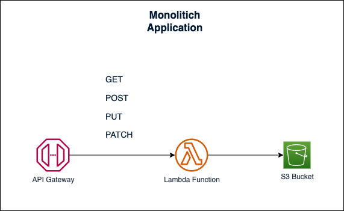

# Cloud Engineering Technical Lead Exam

## Question 1:

**What is the difference between AWS Data Pipeline and AWS Glue?.Describe 2 different use cases for each one**

AWS Glue and AWS Data Pipeline can be considered as powerful ETLs, each one with particular characteristics, 2 of the main differences between them are that AWS Glue is full serverless and AWS Data Pipeline uses EC2 clusters that it up and throws as needed, the other is that AWS Glue uses a CDC trigger pattern, while AWS Data pipeline can perform incremental replication via timestamp, the most extensible is AWS Data Pipeline, since it allows moving data even between regions.

AWS Glue

- Glue can be used to discover the structure of tables on-premises through its JDBC connector and transform the information to store it in DynamoDB for export in the cloud.
- You can use data glue to combine log information originating from an aurora database and log files deposited in S3 and deposit them in amazon redshift and use Athena to analyze them

AWS Data Pipeline

- It can be used, for example, to perform an incremental timestamp copy of an Amazon Aura MySQL table to S3 storage.
- It can be used to create a pipeline that allows files to be backed up from one EFS to another EFS incrementally.

## Question 2:

**Design how you would resolve the connection of two AWS account VPCs with the following conditions:**

**One or more Transit Gateway mustbe used**

**Account A has:**

- VPC
- Site to Site VPN (linked to external datacenter)

**Account B has:**

- VPC
- Direct Connect (linked to telecommunication provider)

The proposal is to use the existing transit gateway to manage the access between two VPCs in separate accounts


## Question 3:

**Describe in a series of numbered steps, how you would deploy a function in AWS, with the following conditions:**

- Lambda function must be in a Git repository (GitHub or GitLab).
- The initial lambda must be deployed with Terraform.
- Code changes (CI/CD) must be managed with Script Bash or Github Actions or GitLab CI.

**Instructions**

1. Create the repository for hosting the lambda code, the GitHub action workflow, and the terraform code, it can be something very basic like:

```bash
	lambda/
		│
	    ├── .github/workflows/
	    │   └── deploy-lambda.yml
		├── terraform/
	    │   ├── main.tf
	    │   ├── lambda.tf
	    │   └── variables.tf
	    ├── lambda.js
		├── update.sh
		└── README.md
```

2. You will configure the AWS credentials of the account that will be used in the github secrets.
3. Write the initial code of the lambda in the `lambda.js` file.
4. Define in `terraform/variables.tf` the variables, like region, profile, lambda name etc.
5. Configure the cloud provider in `terraform/main.tf`
6. Write the code in `terraform/lambda.tf` to describe the permissions, and provisioning of the lambda
7. Write the code for `update.sh` which uses the aws cli to perform different activities.
   1. Set up the CLI with AWS accounts
   2. Remove the current lambda if a deployed version is found.
   3. Generate a zip with the new lambda code
   4. Update the lambda code
8. Define the workflow in `deploy-lamda.yml` considering the following:
   1. Must be activated when `push` on `master`
   2. step 1: Clone the repository
   3. step 2: Configure AWS credentials with aws-actions
   4. step 3: export variables for the CLI
   5. step 4: Write routine for `update.sh` to run

To initially create the lambda infrastructure:

1. Clone the repository
2. Move to the terraform directory: `cd terraform`
3. run, init, plan and apply

To test the update using the Github action.

1. Clone the repository
2. Make a modification to the lambda code
3. Perform git add, git commit, git push
4. The workflow must be triggered and the lambda in AWS must be updated.

## Question 4:

**How would you set up a scaffolding (directory structure) for Terraform code, that respects the following conditions:**

- It must use Terraform modules
- You must manage two different projects
- Each project has three environments (dev, stg, prod).

**Proposal**

With this structure, the modules can be reusables and we have each subproject with your own environments

```bash
terraform/
	    ├── modules/
	    │   ├── network/
	    │   │   ├── main.tf
	    │   │   ├── outputs.tf
	    │   │   └── variables.tf
	    │   └── other-module/
	    │       ├── main.tf
	    │       ├── outputs.tf
	    │       └── variables.tf
	    └── projects/
	        ├── project-01/
	        │   ├── development/
	        │   │   ├── network
			│   │   ├── database
			│   │   ├── (more layers)
	        │   ├── staging/
		    │   │   ├── network
			│   │   ├── database
			│   │   ├── (more layers)
			│   └── production/
		    │       ├── network
			│       ├── database
			│       └── (more layers)
	        └── project-02/
			         ├── development/
					 │   ├── network
					 │   ├── database
					 │   └── (more layers)
				     ├── staging/
					 │   ├── network
					 │   ├── database
					 │   └── (more layers)
					 └── production/
					           ├── network
						       ├── database
						       └── (more layers)
```

## Question 5:

**If you were in charge of Cloud Engineers, what would be for you the three most important KPIs to measure?**

**Answer**

In order to really establish the KPIs for a work team, I would need to know the team and the current project we are running, since these KPIs should be aligned with them.

However, there are some KPIs that I always consider important to measure and that promote continuous improvement and quality in the team.

- **% Compliance:** It allows us to evaluate ourselves with respect to the commitment acquired in the delivery of work.
- **Unplanned Work Time:** It is the difference between the real time taken for the activities vs. the estimated time, it helps us to be aware and to be aware of the effort required for the activities.
- **Dependencies not identified:** It is the number of dependencies that we could not identify when proposing a solution

## Question 6:

**How would you handle the Retrospective ceremony of a Cloud Engineering Staff, having a SCRUM framework implemented (Sprints, Epics, Tasks, etc...)?**

**Answer**

The retrospective is one of the most important ceremonies in scrum, since this is where
the constant adaptation and improvement of the team is carried out, the team must meet after the end of the sprint and the sprint review, this ceremony mainly focuses on reviewing. What was done well during the sprint? And. What can be improved in the process and relationships? Confidence and initiative must be adopted in the team for this meeting to be successful.

For this, the retrospective ceremony is usually planned at a time and day when the team is calm, so that it is effective and 1 hour and a half is allocated for this session, if the sprint is 2 weeks as is common, under the following procedure.

- In a remote environment we meet punctually at the agreed time
- It is important that this ceremony is done with cameras on
- A Mural has been previously prepared with an online tool such as Miro or Notion with 2 sections on each side with the questions mentioned above.
- The welcome is made and a time of 10 minutes is given so that everyone can put something on the blackboard.
- Subsequently, each card is taken and commented by the person who put it giving their point of view
- Always encourage attention in others
- The person who read their card chooses another card from the board and the dynamic continues until the end of the meeting.
- In some section important points are written down that work as next steps
- It should be identified if it is necessary for any of these topics to be seen in a meeting after the retrospective meeting.
- The mural is saved to have it as a reference in the sprint and take into account what we have to work on and to know that we have improved.

## Bonus Question:

**Design and diagram two use cases for S3 Object Lambda, that when using API Gateway + Lambda + S3 represent an overhead in the solution.**

1. The lambda response to multiple requests from different routes


